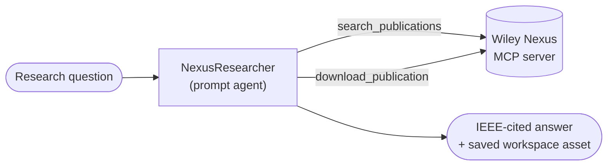
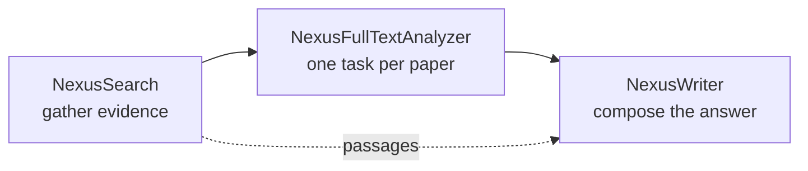

# Wiley Nexus — Scholarly Research Agents

Research agents grounded in Wiley's peer-reviewed scholarly corpus, reached through the
[Wiley Nexus](https://nexus.wiley.com/playground/docs/v1/getting-started/overview) MCP server. Every
factual claim traces to a publication the agent actually retrieved — never to model memory — and
answers close with IEEE-numbered references linked to Wiley Online Library.

## Overview

**NexusResearcher** is the registered agent in this folder. It answers a scientific or technical
question end to end: it plans the query, searches the Nexus corpus from several distinct angles
(letting each result set sharpen the next), optionally reads the most on-point papers in full, and
returns a citation-backed synthesis. It then stays in the conversation to handle follow-ups from the
evidence already gathered, without re-running the whole search.

It works in two modes:

| Mode | When it applies | What you get |
| --- | --- | --- |
| **Research** | A new substantive question needing an evidence base from scratch | A structured, IEEE-cited answer — or a results table if you only asked for the papers |
| **Follow-up** | A question building on an answer already given in the conversation | A short conversational reply, grounded in papers already in play, with at most a targeted single retrieval |

Alongside the interactive agent, this folder ships an optional **three-agent Discovery Engine
pipeline** for autonomous literature reviews, where each shortlisted paper is analysed in its own
parallel task. See [`tasks/`](tasks/README.md).

## Architecture

`NexusResearcher` is a prompt agent — no containerised tools, no custom compute. It calls two remote
tools over the Wiley Nexus MCP server, plus Discovery's built-in resource tools to persist its
finished answer.



The optional pipeline splits the same work across three specialists so that each paper is read in an
isolated context, in parallel:



## Prerequisites

- A Microsoft Discovery workspace and project, with a chat model deployment available to the project.
- **A reasoning model.** These agents are written for and tested with a reasoning model
  (gpt-5.5). Reasoning models reject `temperature` and `top_p`, which is why `agent.yaml` sets no
  model `options`.
- **A Wiley Nexus API key**, for the MCP connection. Nexus is a Wiley commercial service; see the
  [Nexus documentation](https://nexus.wiley.com/playground/docs/v1/getting-started/overview) for
  access.
- Permission to add a tool in the Microsoft Foundry project behind your Discovery workspace.

## Configuration

`agent.yaml` uses the `{{CHAT-MODEL}}` placeholder for the model deployment — supply your own
deployment name at deploy time. Leave the model options unset.

The agent needs the Wiley Nexus MCP tool connected before it can retrieve anything. Registration is
done in Microsoft Foundry, not Discovery Studio:

| Setting | Value |
| --- | --- |
| Tool name | `nexus-domains` |
| Remote MCP server endpoint | `https://nexus.wiley.com/mcp/` |
| Authentication | Key-based |
| Credential | Key `X-Api-Key`, value = your Nexus API key |
| Approval | **Auto-approve all tools** |

> Approval must be set to auto-approve. The default asks for confirmation before every tool call,
> and in an autonomous task run there is nobody to confirm — the agent stalls waiting.

**[`mcp/README.md`](mcp/README.md) is the full walkthrough**, with a screenshot for each step. The API
key lives only in that Foundry connection — never in an agent definition, a task description, or this
repository.

## Usage

Once the MCP tool is connected, address the agent in a Discovery Studio session:

```text
@NexusResearcher What is the evidence on influenza vaccine effectiveness for preventing
influenza illness in adults?
```

It will search, optionally read a couple of papers in full, and answer with numbered citations. Then
follow up conversationally:

```text
What about adults over 65?
Which of those studies was largest?
Give me the full text of #2.
```

Ask for papers rather than prose and you get a table instead:

```text
@NexusResearcher Find recent papers on microplastic toxicity in freshwater invertebrates.
```

For autonomous, multi-paper literature reviews driven by the Discovery Engine, use the pipeline in
[`tasks/`](tasks/README.md) — it includes the three specialist agent definitions and the task field
values to transcribe.

## Known Limitations

- **Full text is not always available.** A search hit without a download token has no retrievable
  full text; the agent cites such papers from their passages instead and flags the limitation.
- **Download tokens are short-lived** (about an hour) and belong to the search that produced them. The
  agent re-searches to mint a fresh one when a token has expired.
- **Full-text reads are capped** — at most two per question in interactive mode, because full-text
  HTML is large and consumes context quickly. The pipeline in `tasks/` exists precisely to lift that
  ceiling by giving each paper its own task.

## Support

For questions about the Wiley Nexus service, corpus coverage, or API access, see the
[Wiley Nexus documentation](https://nexus.wiley.com/playground/docs/v1/getting-started/overview) or
contact `nexus@wiley.com`.

For issues with this catalog entry, open a discussion in the
[Microsoft Discovery repository](https://github.com/microsoft/discovery/discussions).

## Contributing

Improvements to these agent definitions are welcome. Please read
[CONTRIBUTING.md](../../CONTRIBUTING.md) in the repository root for the catalog's submission flow,
schema requirements, and PR checks.
