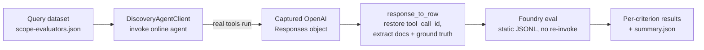

# Agent Evaluation (sample)

A small sample that shows how to evaluate a Microsoft
Discovery / Foundry agent end to end. It drives the **online** Discovery agent
against curated query datasets, captures each response through the Discovery
workspace data-plane, and scores the captured responses with Azure AI Foundry
built-in evaluators.

Use it as a starting point to build your own evaluation pipeline: swap in your
project, agent, bookshelf documents, and dataset queries.

> **Scope note:** like everything under `utilities/`, this sample targets
> **Microsoft Discovery services** (the Azure cloud experience). It is not used
> by the local Discovery app and is not run by any workflow in this repository.
> It is a copyable reference, not operational tooling for this repo.

---

## What it does

The orchestrator [`evaluators/pipeline.py`](evaluators/pipeline.py) runs, per
selected evaluation **scope**, this sequence:

1. **Resolve the dataset for the scope.** A scope `<scope>` is backed by a
   `<scope>-evaluators.json` file. A project-specific dataset under
   `datasets/<project>/` is preferred, falling back to `datasets/default/`.
2. **Create a fresh investigation** so evaluation traffic stays isolated from
   real user/production investigations.
3. **Invoke the online agent per query** through the workspace data-plane
   (`POST /conversations/.../openai/v1/responses`), polling to a terminal
   status. The **real Discovery-runtime tools execute** because the agent runs
   inside Discovery.
4. **Convert each response to an eval row.** The captured OpenAI *Responses*
   object is transformed into an offline-eval row: `tool_call_id` is restored
   from the `call_id` pairing each `function_call` with its
   `function_call_output`, retrieved documents are extracted from
   `file_citation` annotations, and ground-truth fields are carried through.
5. **Assemble a Foundry dataset and score it** as a static-JSONL Foundry eval.
   The agent is never re-invoked by the eval service — only the captured rows
   are scored.
6. **Report results** — per-criterion pass/fail/errored counts and an overall
   exit code, with all artifacts written under `--output-dir`.



### Module map

| File | Responsibility |
| --- | --- |
| [`evaluators/pipeline.py`](evaluators/pipeline.py) | End-to-end orchestrator + CLI entry point. |
| [`evaluators/discovery_client.py`](evaluators/discovery_client.py) | Data-plane client that invokes the online agent (investigation -> conversation -> response). |
| [`evaluators/responses_to_eval_dataset.py`](evaluators/responses_to_eval_dataset.py) | Converts a captured Responses object into a well-formed offline-eval row. |
| [`evaluators/eval_datasets.py`](evaluators/eval_datasets.py) | Scope discovery, dataset resolution, and Foundry dataset assembly. |
| [`evaluators/run_offline_eval.py`](evaluators/run_offline_eval.py) | Runs Foundry evaluators over captured rows; also a standalone offline CLI. |
| [`evaluators/azure_credential.py`](evaluators/azure_credential.py) | Credential factory that survives long-running GitHub OIDC jobs. |
| [`evaluators/invoke_and_capture.py`](evaluators/invoke_and_capture.py) | Helper for invoking an agent and capturing a single response. |

---

## Evaluation scopes and datasets

Scopes are **data-driven**: adding a scope requires no code change, only a new
`<scope>-evaluators.json` file under `datasets/<project>/` or
`datasets/default/`. The sample ships three scopes for a literature-research
agent under [`datasets/literature-agent/`](datasets/literature-agent):

| Scope | Backing file | Evaluators |
| --- | --- | --- |
| `shared` | `shared-evaluators.json` | Task Adherence, Task Completion, Intent Resolution, Indirect Attack, Code Vulnerability, Coherence, Fluency, and risk/safety (violence, sexual, self-harm, hate/unfairness) |
| `tool-calling` | `tool-calling-evaluators.json` | Groundedness, Tool Call Accuracy, Tool Input Accuracy, Tool Output Utilization, Tool Call Success |
| `retrieval` | `retrieval-evaluators.json` | Document Retrieval (needs `retrieval_ground_truth`) |

A dataset file lists the evaluators and the `data` rows. Each row supplies at
least a `query`; retrieval rows also supply `retrieval_ground_truth`. Any field
other than `query` (and doc-only keys prefixed with `_`) is treated as ground
truth and carried into the captured eval row.

The document ids in the retrieval dataset are **fictional placeholders** — replace
them with the real document names indexed in your bookshelf so
`builtin.document_retrieval` can compare retrieved vs. expected documents.

An illustrative target agent lives under
[`sample-agent/`](sample-agent) (`agent.yaml` + `metadata.yaml`). It is a generic
literature-research prompt agent; adapt it, or point the pipeline at your own
agent.

---

## How to run

### Prerequisites

- Python >= 3.10.
- A Discovery workspace with your agent deployed, and its **data-plane endpoint**
  (`https://ws-<id>.workspace.discovery.azure.com`).
- A Foundry **project endpoint** and a **model deployment** for the LLM-judge
  evaluators.
- Access to the Discovery data-plane audience
  (`https://discovery.azure.com/.default`).

### Option A — Run locally

```bash
# Install dependencies.
pip install "./utilities/agent-evaluation[evaluation]"

# Authenticate to the Discovery data-plane audience.
az login --scope https://discovery.azure.com/.default

# Run the pipeline for one agent across the three sample scopes.
python utilities/agent-evaluation/evaluators/pipeline.py \
    --data-plane-endpoint https://ws-<id>.workspace.discovery.azure.com \
    --discovery-project Literature-Research \
    --agent LiteratureAgent \
    --project-endpoint <foundry-project-endpoint> \
    --deployment-name gpt-4o \
    --datasets-dir utilities/agent-evaluation/datasets \
    --dataset-project literature-agent \
    --scopes shared,tool-calling,retrieval \
    --max-queries 0 \
    --fail-on errored \
    --output-dir ./artifacts/agent-eval
```

### Option B — GitHub Actions

Copy [`workflows/agent-evaluation.yml`](workflows/agent-evaluation.yml) into your
own repository's `.github/workflows/` and set these repository variables:

- Auth (OIDC): `AZURE_CLIENT_ID`, `AZURE_TENANT_ID`, `AZURE_SUBSCRIPTION_ID`
- Endpoints: `DISCOVERY_DATA_PLANE_ENDPOINT`, `PROJECT_ENDPOINT`,
  `EVALUATION_DEPLOYMENT_NAME`

Authentication uses GitHub OIDC via `azure/login@v2`. Because Discovery
investigations can run for many minutes, the credential factory re-mints a fresh
OIDC token on every refresh.

---

## Adapting this sample

- **New agent / project:** change `--discovery-project`, `--agent`, and
  `--dataset-project`, and point `--project-endpoint` at your Foundry project.
- **New queries:** edit the `<scope>-evaluators.json` files (or add a new
  `datasets/<your-project>/` directory that overrides `datasets/default/`).
- **New scope:** drop a `<scope>-evaluators.json` file — no code change needed.
